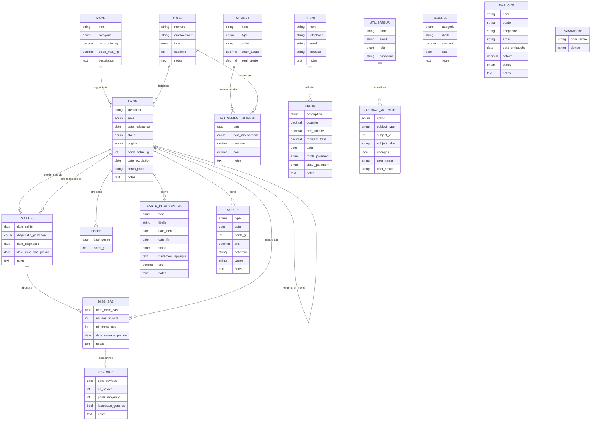

# Analyse MERISE — Plateforme de gestion d'élevage cunicole

## 1. Périmètre de l'étude

Cette analyse couvre le système d'information métier de la plateforme : suivi du cheptel, reproduction, santé, alimentation, sorties, clients/ventes, dépenses, employés, utilisateurs et journal d'activité.

Les tables techniques propres au framework Laravel (`sessions`, `cache`, `cache_locks`, `jobs`, `job_batches`, `failed_jobs`, `password_reset_tokens`) ne sont pas des entités du domaine métier et sont donc exclues du MCD — elles n'ont pas de sens en dehors de l'infrastructure applicative.

---

## 2. Dictionnaire des données

| Rubrique | Signification | Type | Entité(s) porteuse(s) |
|---|---|---|---|
| id | Identifiant unique | Numérique | Toutes |
| identifiant | Numéro de boucle / identification du lapin | Alphanumérique | LAPIN |
| sexe | Mâle, femelle ou indéterminé | Énuméré | LAPIN |
| date_naissance | Date de naissance | Date | LAPIN |
| statut | État du lapin (jeune, reproducteur, engraissement, vendu, abattu, mort, donné) | Énuméré | LAPIN |
| origine | Naissance à l'élevage ou achat | Énuméré | LAPIN |
| poids_actuel_g | Dernier poids connu (grammes) | Numérique | LAPIN |
| date_acquisition | Date d'entrée dans l'élevage | Date | LAPIN |
| photo_path | Chemin de la photo | Texte | LAPIN |
| nom | Nom (race, client, employé, ferme) | Texte | RACE, CLIENT, EMPLOYE, PARAMETRE |
| categorie | Catégorie de race (naine, légère, moyenne, lourde) | Énuméré | RACE |
| poids_min_kg / poids_max_kg | Fourchette de poids adulte | Numérique | RACE |
| numero | Numéro du clapier | Alphanumérique | CAGE |
| emplacement | Localisation du clapier | Texte | CAGE |
| type | Type de clapier / d'aliment / de mouvement / d'intervention / de sortie | Énuméré | CAGE, ALIMENT, MOUVEMENT_ALIMENT, SANTE_INTERVENTION, SORTIE |
| capacite | Capacité d'accueil du clapier | Numérique | CAGE |
| date_saillie | Date de l'accouplement | Date | SAILLIE |
| diagnostic_gestation | Résultat du diagnostic (attente, positif, négatif) | Énuméré | SAILLIE |
| date_diagnostic | Date du diagnostic | Date | SAILLIE |
| date_mise_bas_prevue | Date prévisionnelle de mise bas | Date | SAILLIE |
| date_mise_bas | Date réelle de mise bas | Date | MISE_BAS |
| nb_nes_vivants / nb_morts_nes | Effectifs de la portée | Numérique | MISE_BAS |
| date_sevrage_prevue | Date prévisionnelle de sevrage | Date | MISE_BAS |
| date_sevrage | Date réelle de sevrage | Date | SEVRAGE |
| nb_sevres | Nombre de lapereaux sevrés | Numérique | SEVRAGE |
| poids_moyen_g | Poids moyen à la sortie | Numérique | SEVRAGE |
| lapereaux_generes | Indique si les fiches lapin de la portée ont été créées | Booléen | SEVRAGE |
| date_pesee | Date de la pesée | Date | PESEE |
| poids_g | Poids relevé | Numérique | PESEE, SORTIE |
| libelle | Intitulé de l'intervention / de la dépense | Texte | SANTE_INTERVENTION, DEPENSE |
| date_debut / date_fin | Période de l'intervention santé | Date | SANTE_INTERVENTION |
| traitement_applique | Description du traitement | Texte | SANTE_INTERVENTION |
| cout | Coût associé | Numérique | SANTE_INTERVENTION, MOUVEMENT_ALIMENT |
| stock_actuel | Quantité en stock | Numérique | ALIMENT |
| seuil_alerte | Seuil de déclenchement d'alerte de stock bas | Numérique | ALIMENT |
| unite | Unité de mesure du stock | Texte | ALIMENT |
| type_mouvement | Entrée ou distribution de stock | Énuméré | MOUVEMENT_ALIMENT |
| quantite | Quantité mouvementée / vendue | Numérique | MOUVEMENT_ALIMENT, VENTE |
| date | Date de l'opération | Date | MOUVEMENT_ALIMENT, SORTIE, VENTE, DEPENSE |
| prix | Prix perçu à la sortie | Numérique | SORTIE |
| acheteur | Nom de l'acheteur (sortie) | Texte | SORTIE |
| cause | Cause de la sortie (mort, don...) | Texte | SORTIE |
| telephone / email / adresse | Coordonnées | Texte | CLIENT, EMPLOYE |
| description | Description de la vente | Texte | VENTE |
| prix_unitaire | Prix unitaire de vente | Numérique | VENTE |
| montant_total | Montant total (calculé) | Numérique | VENTE |
| mode_paiement | Espèces, mobile money, virement, crédit | Énuméré | VENTE |
| statut_paiement | Payé, partiel, impayé | Énuméré | VENTE |
| categorie (dépense) | Poste de dépense | Énuméré | DEPENSE |
| montant | Montant de la dépense | Numérique | DEPENSE |
| poste | Fonction de l'employé | Texte | EMPLOYE |
| date_embauche | Date d'embauche | Date | EMPLOYE |
| salaire | Rémunération mensuelle | Numérique | EMPLOYE |
| devise | Devise utilisée par la plateforme | Texte | PARAMETRE |
| name / password / role | Identité et habilitation du compte | Texte / Énuméré | UTILISATEUR |
| action | Type d'action journalisée | Énuméré | JOURNAL_ACTIVITE |
| subject_type / subject_id | Référence de l'élément concerné | Texte / Numérique | JOURNAL_ACTIVITE |
| subject_label | Libellé lisible de l'élément concerné | Texte | JOURNAL_ACTIVITE |
| changes | Détail des champs modifiés | Texte structuré (JSON) | JOURNAL_ACTIVITE |
| user_name / user_email | Identité figée de l'auteur au moment de l'action | Texte | JOURNAL_ACTIVITE |
| notes | Commentaire libre | Texte | La plupart des entités |

---

## 3. Règles de gestion

- **RG1** — Un lapin appartient au plus à une race ; une race peut concerner plusieurs lapins.
- **RG2** — Un lapin est hébergé dans au plus un clapier ; un clapier peut héberger plusieurs lapins.
- **RG3** — Un lapin a au plus un père et une mère, qui sont eux-mêmes des lapins de l'élevage.
- **RG4** — Une saillie associe obligatoirement un mâle et une femelle, tous deux des lapins reproducteurs.
- **RG5** — Une saillie peut aboutir à une mise bas si le diagnostic de gestation est positif.
- **RG6** — Une mise bas est obligatoirement rattachée à une saillie et à la femelle concernée.
- **RG7** — Une mise bas peut faire l'objet d'un sevrage.
- **RG8** — Un sevrage peut générer automatiquement une fiche « lapin » par lapereau sevré, avec généalogie héritée de la portée.
- **RG9** — Un lapin peut faire l'objet de plusieurs pesées dans le temps.
- **RG10** — Un lapin peut faire l'objet de plusieurs interventions de santé.
- **RG11** — Un lapin peut faire l'objet de plusieurs sorties (vente, abattage, mort, don).
- **RG12** — Un aliment peut faire l'objet de plusieurs mouvements de stock (entrée ou distribution).
- **RG13** — Un mouvement de distribution d'aliment peut concerner un clapier particulier.
- **RG14** — Une vente peut être rattachée à un client, ou rester anonyme.
- **RG15** — Un client peut être associé à plusieurs ventes.
- **RG16** — Le montant total d'une vente est systématiquement recalculé (quantité × prix unitaire).
- **RG17** — Chaque action de création, modification, suppression, restauration ou suppression définitive sur les entités métier est journalisée, avec l'identité de son auteur figée au moment de l'action.
- **RG18** — Les entités Employé, Dépense et Paramètres sont indépendantes du reste du modèle : aucune association structurelle ne les relie aux autres entités à ce stade.
- **RG19** — La suppression d'un lapin, d'une saillie, d'une mise bas, d'un aliment ou d'un client entraîne des conséquences différenciées selon l'entité liée : suppression en cascade de l'historique directement dépendant (pesées, interventions, mouvements de stock), ou simple détachement (mise à null) pour les entités de référence (race, clapier).

---

## 4. Modèle Conceptuel de Données (MCD)

### 4.1 Entités et associations



### 4.2 Table des cardinalités

| Association | Entité 1 | Cardinalité | Entité 2 | Cardinalité | Sens métier |
|---|---|---|---|---|---|
| APPARTENIR | LAPIN | (0,1) | RACE | (0,n) | Un lapin appartient à au plus une race ; une race regroupe 0 à n lapins |
| HEBERGER | LAPIN | (0,1) | CAGE | (0,n) | Un lapin occupe au plus un clapier ; un clapier héberge 0 à n lapins |
| ENGENDRER (père) | LAPIN (enfant) | (0,1) | LAPIN (père) | (0,n) | Un lapin a au plus un père ; un lapin peut être père de 0 à n lapins |
| ENGENDRER (mère) | LAPIN (enfant) | (0,1) | LAPIN (mère) | (0,n) | Un lapin a au plus une mère ; une lapine peut être mère de 0 à n lapins |
| ETRE_LE_MALE_DE | LAPIN | (0,n) | SAILLIE | (1,1) | Un mâle participe à 0 à n saillies ; une saillie exige exactement un mâle |
| ETRE_LA_FEMELLE_DE | LAPIN | (0,n) | SAILLIE | (1,1) | Une femelle participe à 0 à n saillies ; une saillie exige exactement une femelle |
| ABOUTIR_A | SAILLIE | (0,1) | MISE_BAS | (1,1) | Une saillie donne lieu à au plus une mise bas ; une mise bas résulte d'exactement une saillie |
| METTRE_BAS | LAPIN | (0,n) | MISE_BAS | (1,1) | Une femelle peut avoir 0 à n mises bas ; une mise bas concerne exactement une femelle |
| ETRE_SEVREE | MISE_BAS | (0,1) | SEVRAGE | (1,1) | Une mise bas donne lieu à au plus un sevrage ; un sevrage concerne exactement une mise bas |
| ETRE_PESE | LAPIN | (0,n) | PESEE | (1,1) | Un lapin a 0 à n pesées ; une pesée concerne exactement un lapin |
| SUIVRE | LAPIN | (0,n) | SANTE_INTERVENTION | (1,1) | Un lapin a 0 à n interventions santé ; une intervention concerne exactement un lapin |
| SORTIR | LAPIN | (0,n) | SORTIE | (1,1) | Un lapin a 0 à n sorties ; une sortie concerne exactement un lapin |
| MOUVEMENTER | ALIMENT | (0,n) | MOUVEMENT_ALIMENT | (1,1) | Un aliment a 0 à n mouvements ; un mouvement concerne exactement un aliment |
| CONCERNER | CAGE | (0,n) | MOUVEMENT_ALIMENT | (0,1) | Un clapier peut être concerné par 0 à n mouvements ; un mouvement concerne au plus un clapier |
| ACHETER | CLIENT | (0,n) | VENTE | (0,1) | Un client peut avoir 0 à n ventes ; une vente concerne au plus un client (peut rester anonyme) |
| JOURNALISER | UTILISATEUR | (0,n) | JOURNAL_ACTIVITE | (0,1) | Un utilisateur est auteur de 0 à n entrées de journal ; une entrée a au plus un auteur identifié (compte pouvant être supprimé) |

**Cas particulier — JOURNAL_ACTIVITE et les autres entités** : chaque entrée du journal référence l'élément concerné via un couple `subject_type` / `subject_id` (association polymorphe informelle, sans contrainte d'intégrité référentielle en base). Ce mécanisme transversal ne se modélise pas nativement en MCD classique ; il est traité comme une association technique hors périmètre du schéma conceptuel strict, documentée séparément.

**Entités isolées** : EMPLOYE, DEPENSE et PARAMETRE ne portent aujourd'hui aucune association avec le reste du modèle (cf. RG18).

---

## 5. Modèle Logique de Données (MLD)

Notation : soulignement = clé primaire, `#` = clé étrangère.

```
RACE (id, nom, categorie, poids_min_kg, poids_max_kg, description)

CAGE (id, numero, emplacement, type, capacite, notes)

LAPIN (id, identifiant, #race_id, sexe, date_naissance, #pere_id, #mere_id,
       #cage_id, statut, origine, poids_actuel_g, date_acquisition,
       photo_path, notes)
    #race_id  → RACE.id      (SET NULL)
    #pere_id  → LAPIN.id     (SET NULL, réflexive)
    #mere_id  → LAPIN.id     (SET NULL, réflexive)
    #cage_id  → CAGE.id      (SET NULL)

SAILLIE (id, #male_id, #femelle_id, date_saillie, diagnostic_gestation,
         date_diagnostic, date_mise_bas_prevue, notes)
    #male_id    → LAPIN.id   (CASCADE)
    #femelle_id → LAPIN.id   (CASCADE)

MISE_BAS (id, #saillie_id, #femelle_id, date_mise_bas, nb_nes_vivants,
          nb_morts_nes, date_sevrage_prevue, notes)
    #saillie_id → SAILLIE.id (CASCADE)
    #femelle_id → LAPIN.id   (CASCADE)

SEVRAGE (id, #mise_bas_id, date_sevrage, nb_sevres, poids_moyen_g,
         lapereaux_generes, notes)
    #mise_bas_id → MISE_BAS.id (CASCADE)

PESEE (id, #lapin_id, date_pesee, poids_g)
    #lapin_id → LAPIN.id (CASCADE)

SANTE_INTERVENTION (id, #lapin_id, type, libelle, date_debut, date_fin,
                     statut, traitement_applique, cout, notes)
    #lapin_id → LAPIN.id (CASCADE)

SORTIE (id, #lapin_id, type, date, poids_g, prix, acheteur, cause, notes)
    #lapin_id → LAPIN.id (CASCADE)

ALIMENT (id, nom, type, unite, stock_actuel, seuil_alerte)

MOUVEMENT_ALIMENT (id, #aliment_id, #cage_id, date, type_mouvement,
                    quantite, cout, notes)
    #aliment_id → ALIMENT.id (CASCADE)
    #cage_id    → CAGE.id    (SET NULL)

CLIENT (id, nom, telephone, email, adresse, notes)

VENTE (id, #client_id, description, quantite, prix_unitaire,
       montant_total, date, mode_paiement, statut_paiement, notes)
    #client_id → CLIENT.id (SET NULL)

DEPENSE (id, categorie, libelle, montant, date, notes)

EMPLOYE (id, nom, poste, telephone, email, date_embauche, salaire,
         statut, notes)

PARAMETRE (id, nom_ferme, devise)

UTILISATEUR (id, name, email, role, password)

JOURNAL_ACTIVITE (id, #user_id, user_name, user_email, action,
                   subject_type, subject_id, subject_label, changes,
                   created_at)
    #user_id → UTILISATEUR.id (SET NULL)
```

### 5.1 Correspondance avec le schéma physique

Ce MLD correspond fidèlement au schéma physique déjà implémenté (24 tables métier, MySQL). Chaque suppression logique (SET NULL / CASCADE) reflète une décision de gestion :

- **SET NULL** (`race_id`, `pere_id`, `mere_id`, `cage_id`, `cage_id` sur mouvement, `client_id`) : la suppression de l'entité de référence détache l'enregistrement dépendant sans le supprimer — cohérent avec des entités de référence (race, clapier, client) que l'on peut retirer sans perdre l'historique métier qui en dépendait.
- **CASCADE** (`male_id`/`femelle_id`, `saillie_id`, `mise_bas_id`, `lapin_id`, `aliment_id`) : la suppression **définitive** d'un lapin, d'une saillie, d'une mise bas ou d'un aliment entraîne la suppression de tout l'historique qui n'a de sens qu'en lien avec lui (une pesée sans lapin, un sevrage sans mise bas, n'ont pas d'existence propre).

La plupart des entités disposant d'un cycle de vie métier long (LAPIN, RACE, CAGE, ALIMENT, CLIENT, VENTE, DEPENSE, EMPLOYE) implémentent une **suppression douce** (`deleted_at`), permettant une restauration avant toute suppression définitive — ce n'est pas une donnée conceptuelle mais un mécanisme applicatif de sécurité, volontairement absent du MCD.

---

## 6. Synthèse

| Élément | Valeur |
|---|---|
| Nombre d'entités métier (MCD) | 18 |
| Nombre d'associations structurelles | 16 |
| Entités isolées (sans association) | 3 (EMPLOYE, DEPENSE, PARAMETRE) |
| Association réflexive | 1 entité concernée (LAPIN, via père/mère) |
| Mécanisme transversal hors MCD strict | Journal d'activité (association polymorphe) |
| Tables techniques exclues du périmètre | 7 (tables internes Laravel) |
